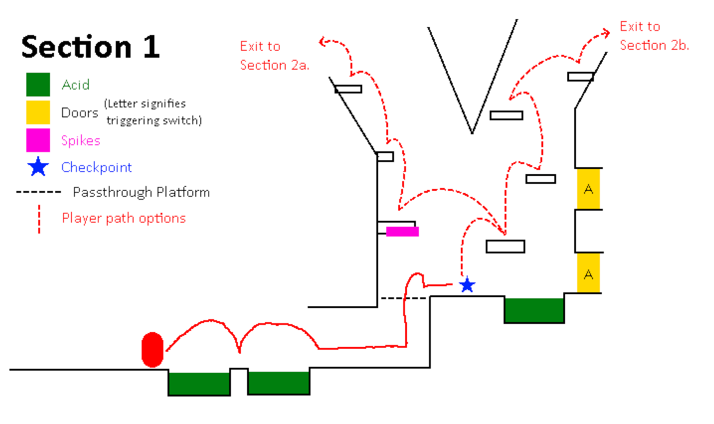
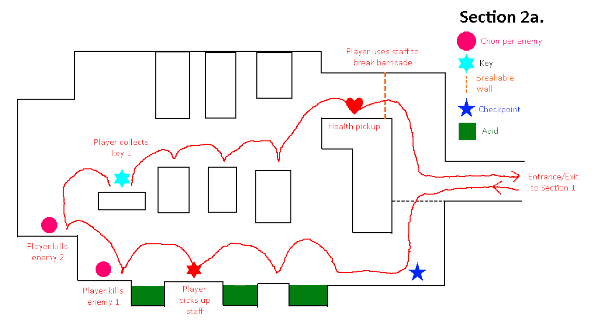
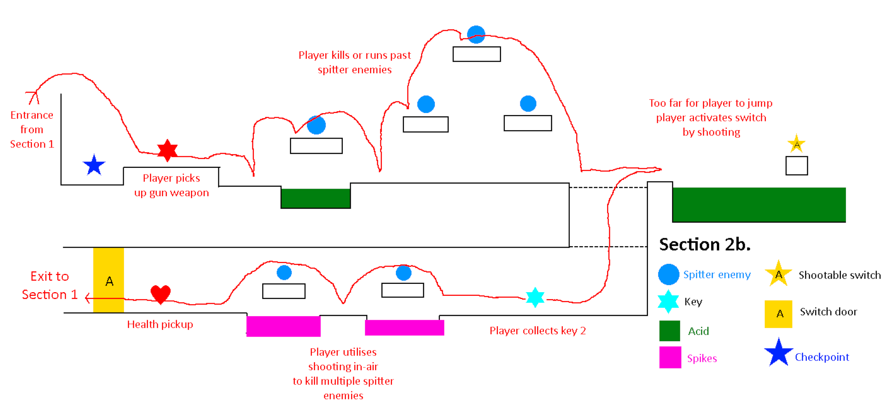
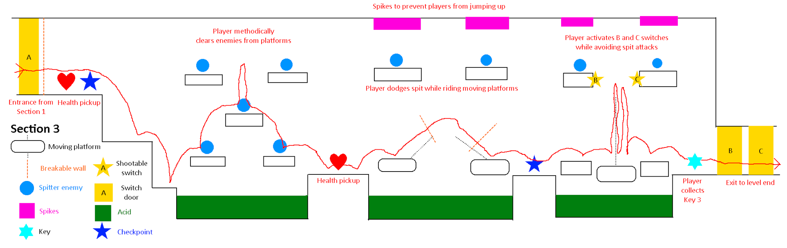

[](https://classroom.github.com/a/YyUO0xtt)
# COMP2150  - Level Design Document
### Name: Luca Tyacke
### Student number: 47786035 

This document discusses and reflects on the design of your platformer level for the Level Design assessment. It should be 1500 words. Make sure you delete this and all other instructional text throughout the document before checking your word count prior to submission. Hint: You can check word count by copying this text into a Word or Google doc.

Your document must include images. To insert an image into your documentation, place it in the "DocImages" folder in this repo, then place the below text where you want the image to appear:

```

```

Example:


## 1. Player Experience (~700 words)
Outline and justify how your level design facilitates the core player experience goals outlined in the assignment spec. Each section should be supported by specific examples and screenshots of your game encounters that highlight design choices made to facilitate that particular experience.

### 1.1. Discovery
*What does the player learn? How does your encounter and broader level design facilitate learning in a way that follows good design practice?*

Player discovery is facilitated by the sectioned and intentional introduction of mechanics. Each section of the level introduces and utilises a specific set of mechanics, and allow the player to familiarise themselves with how each of these mechanics function individually, and how they interact with eachother. Section 1 (rooms 1 and 2) serve to introduce the player to checkpoints, stage hazards (acid and spikes), and to familiarize the player with the platforming. 
Section 2 is comprised of two different encounters, both of which introduce the player to different mechanics. Completing both of these encounters is required to access section 3. After reaching Room 2 the player can choose to go either up-left or up-right, both of which will assist in allowing the player to progress. Each of these encounters introduces a weapon, allows the player to familiarise themselves with combat involving that weapon, and showcases an extra interaction each weapon has with certain level features (breakable walls for the staff, switches for the gun). Each of these encounters rewards a health pickup, and loops back around to Room 2. 
Section 3 is restricted until the player has acquired both weapons. Because of its increased difficulty, it is generous with its checkpoints and health pickups. Section 3 serves to test the player's ability to use all the mechanics they have learned so far in one final gauntlet to the level exit door, accompanied by increased difficulty platforming. 

### 1.2. Drama
*What is the intensity curve? How does your design facilitate increasing yet modulating intensity, with moments of tension and relief?*

The level has a clear dramatic arc that increases with each encounter. The second room's "hub"-like nature means on repeat visits it becomes less of a platforming challenge, and more a familiar period of downtime in the form of simple platforming between the higher difficulty major encounters. Each encounter in section 2 is more dramatic but is rather stable throughout, there is no particular part that is more difficult than the rest of the encounter, and each of these tense encounters returns to the relief of Room 2 with rewards of health pickups after the player has succeeded. The section 3 encounter displays increasing difficulty and drama, making the player act on their toes and utilise all the mechanics they had learned beforehand, before finally reaching the level end door.

### 1.3. Challenge
*What are the main challenges? How have you designed and balanced these challenges to control the difficulty curve and keep the player in the flow channel?*

The challenges within the level largely stem from the combat and platforming, and how the two can be intertwined. The low-to-moderate difficulty platforming in section 1 serves as a respite between the encounters within section 2. Each of the encounters within section 2 requires players to manage both platforming, and low difficulty combat, which should provide a suitable challenge to accompany the learning each encounter encourages. Section 3 takes this notion to its extremes, and provides an encounter that requires the player to engage methodically in combat, effectively dodge enemy projectiles, and manouever across moving platforms, in a gauntlet of combat and platforming that escalates in difficulty until the player finally reaches the end.

### 1.4. Exploration
*How does your level design facilitate autonomy and invite the player to explore? How do your aesthetic and layout choices create distinct and memorable spaces and/or places?*

The level's layout encourages exploration from the player. Aesthetically the level is themed around exploring ancient ruins, which the player progressively gets greater and greater access to through the acquisition of new tools (their weapons and knowledge). Past examples of 2d platformer games (such as the original Super Mario Bros) have established the convention of the player moving across the level from left to right. After moving into Room 2, the player will be immediately met with a door that blocks them from continuing right. Because of this blockage, the player is encouraged to seek out other methods that will allow them to open or circumvent this door, which eventually leads to the discovery of each of the encounters in Section 2.
The section 2 encounters both serve to further the player's goal of being able to get past the locked door by travelling deeper into other parts of the ancient structure. One of the three keys is located in each of these areas, while the third is acquired in section 3. As the player platforms up they will be met with a large terrain obstacle which clearly divides the path they can take upwards in two (each leading to one of the aforementioned encounters). Each of these encounters loop back around to the central area of Room 2, which then allows the player to continue exploring the alternative paths out of this hub section. 
Section 3 is accessed after the player is able to break down the barriers that let them continue to explore right. This is a rather difficult linear section that is supposed to be representative of the player approaching the structure's heart. The challenge it provides drives the player to continue on, and eventually finding the last key and reaching the exit.

## 2. Core Gameplay (~400 words)
A section on Core Gameplay, where storyboards are used to outline how you introduce the player to each of the required gameplay elements in the first section of the game. Storyboards should follow the format provided in lectures.

Storyboards can be combined when multiple mechanics are introduced within a single encounter. Each section should include a sentence or two to briefly justify why you chose to introduce the mechanic/s to the player in that sequence.

You should restructure the headings below to match the order they appear in your level.

### 2.1. Acid

### 2.2. Checkpoints

### 2.3. Chompers

### 2.4. Health Pickups

### 2.5. Keys

### 2.6. Moving Platforms

### 2.7. Passthrough Platforms

### 2.8. Spikes

### 2.9. Spitters

### 2.10. Weapon Pickup (Gun)

### 2.11. Weapon Pickup (Staff)

## 3. Spatiotemporal Design
A section on Spatiotemporal Design, which includes your molecule diagram and annotated level maps (one for each main section of your level). These diagrams may be made digitally or by hand, but must not be created from screenshots of your game. The annotated level maps should show the structure you intend to build, included game elements, and the path the player is expected to take through the level. Examples of these diagrams are included in the level design lectures.

No additional words are necessary for this section (any words should only be within your images/diagrams).
 
### 3.1. Molecule Diagram

### 3.2. Level Map – Section 1


### 3.3.	Level Map – Section 2



### 3.4.	Level Map – Section 3


## 4. Iterative Design (~400 words)
Reflect on how iterative design helped to improve your level. Additional prototypes and design artefacts should be included to demonstrate that you followed an iterative design process (e.g. pictures of paper prototypes, early grey-boxed maps, additional storyboards of later gameplay sequences, etc.). You can also use this section to justify design changes made in Unity after you drew your level design maps shown in section 3. 

You should conclude by highlighting a specific example of an encounter, or another aspect of your level design, that could be improved through further iterative design.

## Generative AI Use Acknowledgement

Use the below table to indicate any Generative AI or writing assistance tools used in creating your document. Please be honest and thorough in your reporting, as this will allow us to give you the marks you have earnt. Place any drafts or other evidence inside this repository. This form and related evidence do not count to your word count.
An example has been included. Please replace this with any actual tools, and add more as necessary.


### No generative AI was used in the making of this project.


